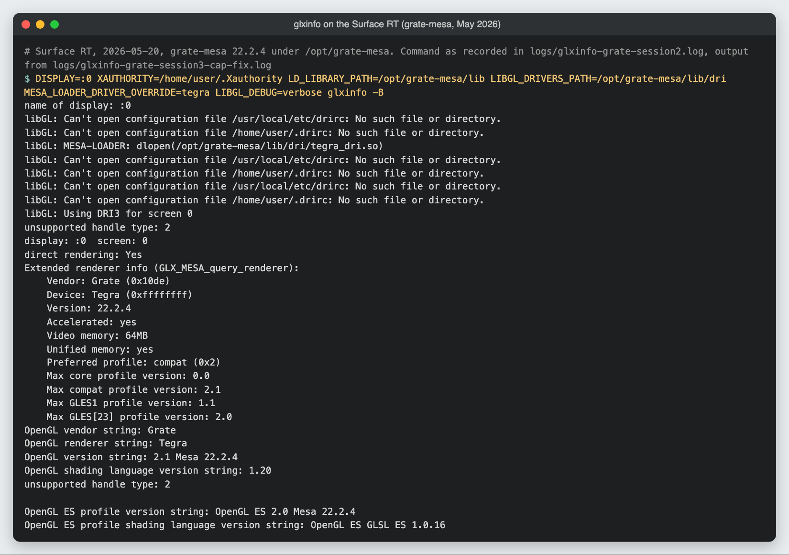
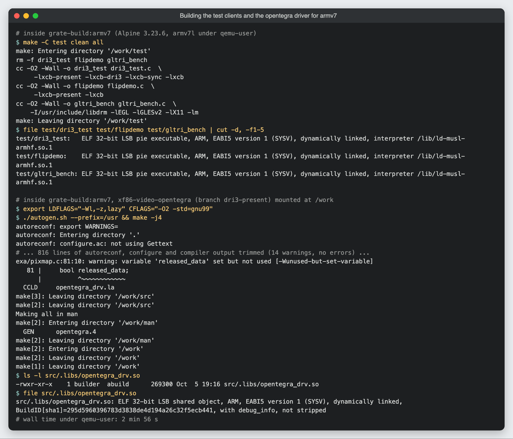
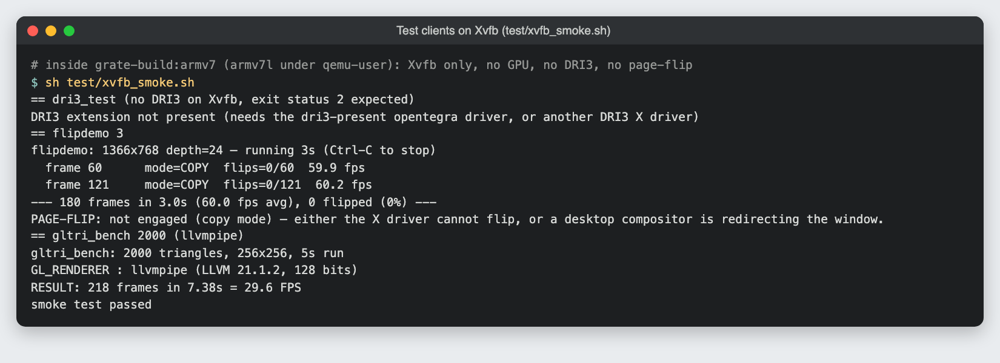
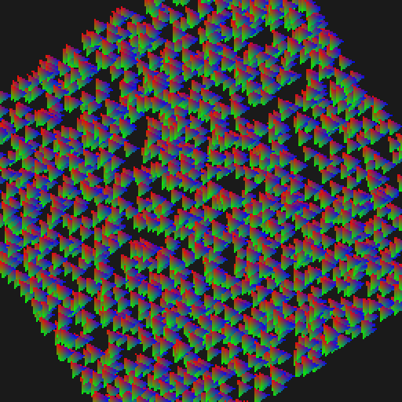
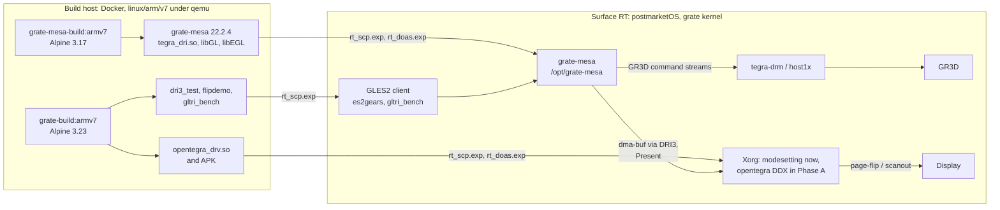

# SurfaceRT-GPU-Driver

> **Status: work in progress.** This is an experimental bring-up project, not
> a driver you can install and use day to day. Hardware OpenGL ES 2 has
> rendered on the Surface RT's GPU, but only in test programs and with a known
> flicker bug, and the project has since changed direction (see
> [Where this is heading](#where-this-is-heading)). Expect rough edges.

Userspace graphics work for the Microsoft Surface RT (2012, NVIDIA Tegra 3 /
T30) running postmarketOS with the grate kernel. Out of the box, Mesa on this
tablet sends every OpenGL call to llvmpipe, which renders on the four
Cortex-A9 cores. The aim here is to get the tablet's own 3D engine (the GR3D)
doing that work instead, so the desktop and light GL apps get real
acceleration.

It is for people hacking on Tegra 2/3 graphics, or running Linux on old ARM
Windows tablets. This repository is the umbrella for that work: build
containers, deploy helpers, test clients, packaging, and the logs from each
session on the device. The driver code itself lives in two forks:

- [LBSiUK/grate-mesa](https://github.com/LBSiUK/grate-mesa), branch
  `grate-22.2.4`: fixes to the grate Gallium driver on Mesa 22.2.4.
- [LBSiUK/xf86-video-opentegra](https://github.com/LBSiUK/xf86-video-opentegra),
  branch `dri3-present`: DRI3 and Present support for the opentegra X driver.

## Status and history

| When | Step | Result |
|---|---|---|
| 2026-05-19/20 | **Phase A**: DRI3 + Present in the opentegra DDX | Worked on hardware: dma-buf round trip through the Tegra IOMMU, Present with real kernel vblank counters, zero-copy page-flips for fullscreen windows, and no regression in EXA 2D acceleration. |
| 2026-05-20 | **Phase 2**: grate-mesa 22.2.4 built and installed under `/opt/grate-mesa` | `glxinfo` reports `Grate` / `Tegra` with OpenGL ES 2.0 instead of llvmpipe. The first GR3D command streams reached the kernel and were rejected. |
| 2026-05-21 | **Milestone**: hardware GL works | `es2tri` renders on the GR3D, and `es2gears` runs at about 60 fps through grate-mesa under the modesetting DDX, which beats llvmpipe. |

Fixes found along the way:

- An uninitialised `no_scissor` command made the kernel reject the whole
  command stream (`invalid class id 0x0` in
  [`logs/dmesg-grate-session2.log`](logs/dmesg-grate-session2.log)). Fixed in
  grate-mesa by seeding it with a valid SCISSOR command.
- `grate_resource_get_handle` could not export buffers as dma-buf file
  descriptors, so the X server was handed an empty framebuffer. grate-mesa now
  exports them.
- opentegra's `drm_tegra_bo_from_dmabuf` did not initialise the buffer
  object's list head, and probed the buffer size with an `lseek` that dma-buf
  rejects. Together they crashed Xorg. Fixed in the opentegra fork, and the
  same fix was ported to grate-mesa's vendored copy of that code.
- Smaller grate-mesa fixes: the constant-buffer cap was reported wrongly
  (assertion on context teardown), and draws larger than the hardware's
  vertex limit are now split (that assertion had blocked `es2gears`).

**Known issue:** `es2gears` flickers heavily. Rendering is correct, but it
renders single-buffered straight to the front buffer, so `eglSwapBuffers` has
nothing to swap. The fix is proper double buffering plus a vsync'd Present.

## Where this is heading

The wider OpenRT project dropped the opentegra DDX in favour of Wayland plus
the generic modesetting driver with glamor, with X11 apps running through
Xwayland. The opentegra DRI3/Present work in this repo is therefore kept for
reference rather than developed further.

Active Mesa work for Tegra 2/3 continues at
[codeberg.org/libre-tegra/mesa](https://codeberg.org/libre-tegra/mesa), branch
`grate-wip`. It uses the modern mainline tegra-drm API and a proper NVIDIA
register header in place of magic numbers, so the `grate-22.2.4` fork used
here is a superseded base: new driver work should start from `grate-wip`.

The GR3D is a GLES2 / Shader Model 2.0 class GPU. Its vertex unit has flow
control; its fragment unit has none (both sides of an `if` execute). Modern
desktop GL and Vulkan are out of reach, so the realistic goal is GLES2-class
desktop acceleration: compositing, 2D, video and light apps. The current
frontier there is a NIR vertex-shader compiler.

[`docs/PHASE2_ROADMAP.md`](docs/PHASE2_ROADMAP.md) is the plan from before this
change and is kept as a record.

## Screenshots

There are no photos or screen captures from the Surface RT in this repo yet.
The first image renders real output from the device, saved in `logs/` during
the May 2026 sessions. The rest were captured while preparing this README, inside
the emulated armv7 build container with a virtual X server (Xvfb, no GPU), so
they show the tools building and running, not GR3D rendering.



*`glxinfo -B` on the Surface RT with grate-mesa: the renderer is the Tegra GR3D, not llvmpipe (from [`logs/glxinfo-grate-session3-cap-fix.log`](logs/glxinfo-grate-session3-cap-fix.log)).*



*Building the test clients and the opentegra driver in the `grate-build:armv7` container (Alpine 3.23 under qemu-user).*



*`test/xvfb_smoke.sh` running the three clients against Xvfb. Without a GPU there is no DRI3 and no page-flipping, so this checks the clients, not the driver.*


*Three frames of `flipdemo` on the 1366x768 virtual screen. On the device, with the opentegra fork, each frame is a page-flip.*



*The `gltri_bench` window (256x256, shown at 2x), rendered by llvmpipe in the container.*

## What is in this repo

- **Build containers** for armv7 musl: `Dockerfile.grate-build` (Alpine 3.23,
  matching the device's libc and Xorg ABI, for the DDX, test clients and APK)
  and `Dockerfile.grate-mesa-build` (Alpine 3.17, whose Python, meson and mako
  match what Mesa 22 expects).
- **Test clients** in `test/`:
  - `dri3_test`: XCB test of DRI3 `fds_from_pixmap` / `pixmap_from_fds`,
    Present `notify_msc`, and whether a fullscreen present flips or copies.
  - `flipdemo`: fullscreen sweeping bar presented every frame, with a live
    flip/copy and fps readout.
  - `gltri_bench` and `run_bench.sh`: a small GLES2 benchmark that runs once on
    llvmpipe and once on grate-mesa for an A/B comparison.
  - `xvfb_smoke.sh`: runs all three against Xvfb when the device is not to
    hand.
- **Deploy helpers** in `scripts/`: expect wrappers for ssh, scp and
  ssh + doas that answer password prompts, so builds can be pushed to the
  device from a script.
- **Packaging**: an Alpine `APKBUILD` for the DRI3 + Present opentegra fork,
  installable as a straight upgrade over the stock community package.
- **Logs** from the device sessions: `glxinfo`, `es2tri`, `es2gears`, `dmesg`,
  a decoded GR3D command stream, and the first full grate-mesa build.

## How to run

Everything below runs from the repository root. The build steps were tested
from a clean clone on an Apple Silicon Mac with Docker in Colima; times are
from that machine under qemu emulation. Nothing in this section was run on a
Surface RT for this README.

### Prerequisites

- Docker that can run `linux/arm/v7` containers. On an arm64 or x86-64 host
  that means registering qemu-user (run it again after the Docker VM
  restarts):

  ```sh
  docker run --privileged --rm tonistiigi/binfmt --install arm
  ```

  With Colima, keep the checkout under your home folder so it can be
  bind-mounted.
- About 1.6 GB of disk for the `grate-build` image (and 0.5 GB more for
  `grate-mesa-build`).
- For the deploy helpers: `expect` and OpenSSH on the host.
- For anything on hardware: a Surface RT running postmarketOS with the grate
  kernel (`linux-postmarketos-grate`), reachable over ssh, with `doas`.

### 1. Build the container

```sh
git clone https://github.com/LBSiUK/SurfaceRT-GPU-Driver.git
cd SurfaceRT-GPU-Driver
docker buildx build --platform linux/arm/v7 --load \
    -t grate-build:armv7 -f Dockerfile.grate-build .
```

About 3 minutes. Stay on a fixed Alpine release: `alpine:edge` brings a newer
Python that breaks Mesa's mako templates.

### 2. Build and smoke-test the test clients

```sh
docker run --rm --platform linux/arm/v7 -v "$PWD:/work" grate-build:armv7 make -C test
docker run --rm --platform linux/arm/v7 -v "$PWD:/work" grate-build:armv7 sh test/xvfb_smoke.sh
```

The binaries land in `test/`. The smoke test installs Xvfb in the throwaway
container, expects `dri3_test` to report that DRI3 is missing, and checks that
`flipdemo` and `gltri_bench` run. There is no other test suite.

### 3. Build the opentegra driver (Phase A)

```sh
mkdir -p src
git clone -b dri3-present https://github.com/LBSiUK/xf86-video-opentegra.git \
    src/xf86-video-opentegra
docker run --rm --platform linux/arm/v7 \
    -v "$PWD/src/xf86-video-opentegra:/work" grate-build:armv7 \
    bash -c 'export LDFLAGS="-Wl,-z,lazy" CFLAGS="-O2 -std=gnu99" &&
             ./autogen.sh --prefix=/usr && make -j4'
```

About 3 minutes. Output: `src/xf86-video-opentegra/src/.libs/opentegra_drv.so`
(about 270 KB). The fork has five commits on top of grate-driver's
xf86-video-opentegra:

1. `exa: export TegraEXAThawPixmap helper for cross-TU use`
2. `Add DRI3 screen support`
3. `Add Present extension support (copy mode)`
4. `Add Present page-flip (check_flip/flip/unflip)`
5. `tegradrm: fix drm_tegra_bo_from_dmabuf crash and spurious import failure`

### 4. Package it as an APK

```sh
docker run --rm --platform linux/arm/v7 -v "$PWD:/work" grate-build:armv7 bash -c '
    abuild-keygen -a -i -n
    cd packaging/xf86-video-opentegra
    export REPODEST=/work/packaging/apk-out
    abuild -r'
```

About 3 minutes. Output:
`packaging/apk-out/packaging/armv7/xf86-video-opentegra-0.6.0_git20260520-r0.apk`.
The signing key is made fresh in the throwaway container, which is why the
install below uses `--allow-untrusted`. The `APKBUILD` pins commit `3c8871d`
(page-flip), which predates the dma-buf import fix; after changing `_commit`,
run `abuild checksum` before `abuild -r`.

### 5. Build grate-mesa (not re-run for this README)

The Mesa build takes a long time under emulation, so only the container image
was rebuilt for this README. These are the commands and options used in the
May 2026 sessions; new work should target libre-tegra `grate-wip` instead.

```sh
docker buildx build --platform linux/arm/v7 --load \
    -t grate-mesa-build:armv7 -f Dockerfile.grate-mesa-build .
git clone -b grate-22.2.4 https://github.com/LBSiUK/grate-mesa.git src/grate-mesa-grate
docker run --rm --platform linux/arm/v7 \
    -v "$PWD/src/grate-mesa-grate:/work/mesa" grate-mesa-build:armv7 sh -c '
    cd /work/mesa &&
    meson setup build -Dgallium-drivers=grate,swrast -Dvulkan-drivers= \
        -Dplatforms=x11 -Dgles2=true -Dglx=dri -Degl=enabled -Dgbm=enabled \
        -Dllvm=disabled &&
    ninja -C build'
```

The grate driver is built as `tegra_dri.so`, not `grate_dri.so`. On the device
it was installed into `/opt/grate-mesa`, alongside the system Mesa rather than
replacing it.

### 6. Deploy to the device

The helpers in `scripts/` read their settings from the environment:

| Variable | Default | Meaning |
|---|---|---|
| `RT_HOST` | `microsoft-surface-rt.local` | Hostname or address of the Surface RT |
| `RT_USER` | `user` | Login user on the device |
| `RT_PORT` | `22` | ssh port |
| `RT_PASS` | (asked for once, not echoed) | Password used for both ssh and doas |
| `RT_SSH_OPTS` | (none) | Extra ssh/scp options |

```sh
export RT_HOST=<device address> RT_USER=<your user>
scripts/rt_scp.exp test/dri3_test /tmp/dri3_test
scripts/rt_scp.exp test/flipdemo /tmp/flipdemo
scripts/rt_scp.exp \
    packaging/apk-out/packaging/armv7/xf86-video-opentegra-0.6.0_git20260520-r0.apk \
    /tmp/xf86-video-opentegra.apk
# apk 3.x prompts interactively; </dev/null makes it proceed
scripts/rt_doas.exp "apk add --allow-untrusted /tmp/xf86-video-opentegra.apk </dev/null"
scripts/rt_doas.exp "systemctl restart lightdm"
```

This upgrades over the stock community package. A host key is accepted on
first contact and refused if it changes later, so after reflashing the device
run `ssh-keygen -R <device address>`.

### 7. Check it on the device

In an ssh session on the Surface RT:

```sh
grep -E "DRI3|Present" /var/log/Xorg.0.log | grep opentegra
# expected:
#   (II) opentegra(0): DRI3 initialized
#   (II) opentegra(0): Present initialized (page-flip)

DISPLAY=:0 XAUTHORITY=/var/run/lightdm/root/:0 /tmp/dri3_test
# expected last lines:
#   present N: mode=1 (FLIP) ...
#   FLIP CONFIRMED: page-flip path engaged
#   OK

# a watchable fullscreen demo: sweeping bar, live fps
DISPLAY=:0 XAUTHORITY=/var/run/lightdm/root/:0 /tmp/flipdemo 15
```

Run both against the lightdm greeter: a running desktop compositor
legitimately forces Present back to copy mode.

To run a GLES2 program on grate-mesa (the client side of the milestone above):

```sh
DISPLAY=:0 XAUTHORITY=/var/run/lightdm/root/:0 \
LD_LIBRARY_PATH=/opt/grate-mesa/lib \
LIBGL_DRIVERS_PATH=/opt/grate-mesa/lib/dri \
MESA_LOADER_DRIVER_OVERRIDE=tegra \
    es2gears_x11
```

`es2gears_x11` and `es2tri` come from the `mesa-demos` package. For the A/B
benchmark, copy `test/gltri_bench` and `test/run_bench.sh` into the same folder
on the device and run `doas sh run_bench.sh 20000`: it runs once on llvmpipe
and once on grate-mesa and prints both frame rates.

### Rollback

```sh
# revert to the stock community package
doas apk add xf86-video-opentegra
doas systemctl restart lightdm
# or, if the community repo is unreachable, restore a backup of the stock
# driver taken before the first install:
#   doas cp /usr/lib/xorg/modules/drivers/opentegra_drv.so.bak \
#           /usr/lib/xorg/modules/drivers/opentegra_drv.so
```

## Architecture



**On the build host**, two armv7 containers stand in for a cross toolchain.
Apple Silicon cannot run 32-bit ARM code natively, so they run under qemu-user:
slow, but they match the device's musl, Xorg and library versions exactly. One
image builds the X driver, the test clients and the APK; the other is pinned to
an older Alpine because Mesa 22's build scripts break on newer Python and
meson.

**On the device**, a GLES2 program loads grate-mesa from `/opt/grate-mesa`
through `LD_LIBRARY_PATH`, `LIBGL_DRIVERS_PATH` and
`MESA_LOADER_DRIVER_OVERRIDE=tegra`. grate-mesa compiles the shaders and turns
draw calls into GR3D command streams, which it submits through the kernel's
tegra-drm / host1x interface. Finished buffers are shared with the X server as
dma-bufs over DRI3 and put on screen with Present. In Phase A that X side was
the patched opentegra DDX; the milestone ran under the generic modesetting
driver instead, whose own glamor still renders in software because the system
Mesa has no Tegra driver.

### Project layout

| Path | Purpose |
|---|---|
| `Dockerfile.grate-build` | Alpine 3.23 armv7 build image: DDX, test clients, APK |
| `Dockerfile.grate-mesa-build` | Alpine 3.17 armv7 build image for grate-mesa 22.2.4 |
| `test/dri3_test.c` | XCB DRI3 + Present round-trip and page-flip test |
| `test/flipdemo.c` | Fullscreen Present page-flip demo with fps readout |
| `test/gltri_bench.c`, `test/run_bench.sh` | GLES2 throughput benchmark, llvmpipe vs grate-mesa |
| `test/xvfb_smoke.sh` | Runs the clients against Xvfb, no device needed |
| `test/Makefile` | Builds the three clients |
| `scripts/rt_ssh.exp`, `rt_doas.exp`, `rt_scp.exp` | ssh, ssh + doas and scp helpers that answer password prompts |
| `scripts/rt_common.tcl` | Shared settings for the helpers (`RT_*` variables) |
| `packaging/xf86-video-opentegra/APKBUILD` | Alpine package for the DRI3 + Present opentegra fork |
| `logs/` | Output captured on the device and from the first grate-mesa build |
| `docs/PHASE2_ROADMAP.md` | The session-by-session plan for Phase 2 (historical) |
| `docs/screenshots/` | Images used in this README |
| `src/` (ignored) | Local clones of the forks and upstream trees |

## Limitations

- Hardware rendering has only been shown with test programs. There is no
  accelerated desktop yet, and `es2gears` flickers (see above).
- The work targets the grate kernel's original tegra-drm interface. The
  libre-tegra `grate-wip` branch moved to the mainline interface, so the
  grate-mesa fixes here may not carry over as they are.
- The opentegra DDX track is parked: the fork works, but nothing further is
  planned for it.
- The deploy helpers drive password prompts with `expect`. If the device has
  ssh keys and a `nopass` doas rule, plain `ssh` and `scp` are simpler.

## Licence and credits

Built on the [grate-driver](https://github.com/grate-driver) project
(xf86-video-opentegra and the grate Mesa driver), the libre-tegra Mesa work,
and postmarketOS. The forks keep their upstream licences. This repository does
not have a licence file yet.
